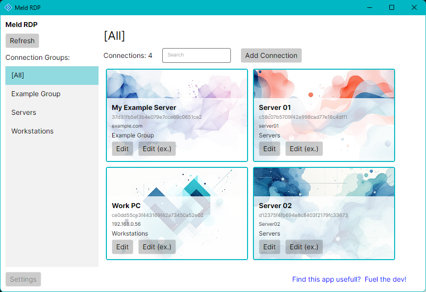
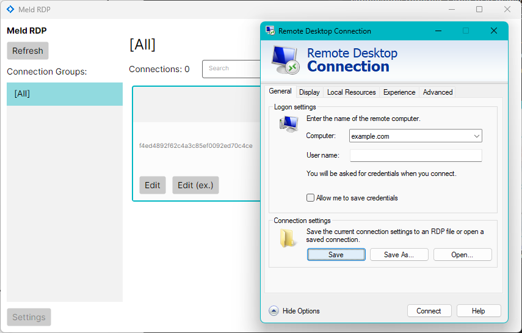

# Meld RDP

## Description
A fast, portable application to manage your remote desktop connections.

I built this application to manage my remote desktop connections. I wanted a simple,
fast, and portable application where I can keep my RDP connections together. Other RDP
managers I found were either too slow, too complex, or not portable.

I know this tool will be useful for others, so I decided to share it. If it
helps you, please consider [buying me a coffee](https://buymeacoffee.com/cleon). You
can also find the link in the application.

## Features
- [x] Portable
- [x] Quick startup
- [x] Simple to use
- [x] Keyboard shortcuts for quick connections
- [x] Multi-monitor span support
- [x] Keep session alive
- [x] Light and Dark theme support (follows OS setting)

## Quick Start
- Unzip the downloaded file and run `Meld RDP.exe`.

- Add a new connection by clicking the `Add Connection` button (or <kbd>Alt + a</kbd>).
- The standard RDP connection editor window will pop up, fill in the connection details
and click `Save`.

- Once the RDP edit window is closed, a simpler edit window will pop up where you can give
your connection a Name and Group, click `Save` to close when done.

- Your connection will now appear in the main window. Click it (or <kbd>Ctrl + 1</kbd>)
to start the connection.

- All RDP files are saved in the `Data` folder in the same directory as the application.

## Notes
- For the 'Keep session alive' feature to work, this application ships with `MsRdpEx.dll`
and `mstscex.exe` which are developed and maintained by Devolutions
(https://github.com/Devolutions/MsRdpEx)

## Keyboard Shortcuts
- <kbd>Alt + a</kbd> - Add Connection
- <kbd>Ctrl + 1</kbd> to <kbd>Ctrl + 0</kbd> - Connect to the item in that list position (note
that <kbd>Ctrl + 0</kbd> will connect to the 10th connection in the visible list)
- <kbd>Ctrl + r</kbd> - Refresh the connection list

