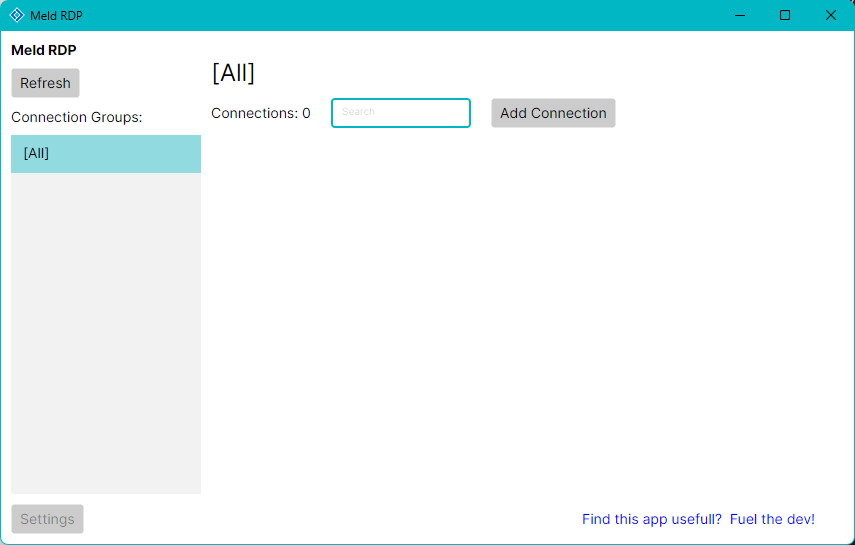
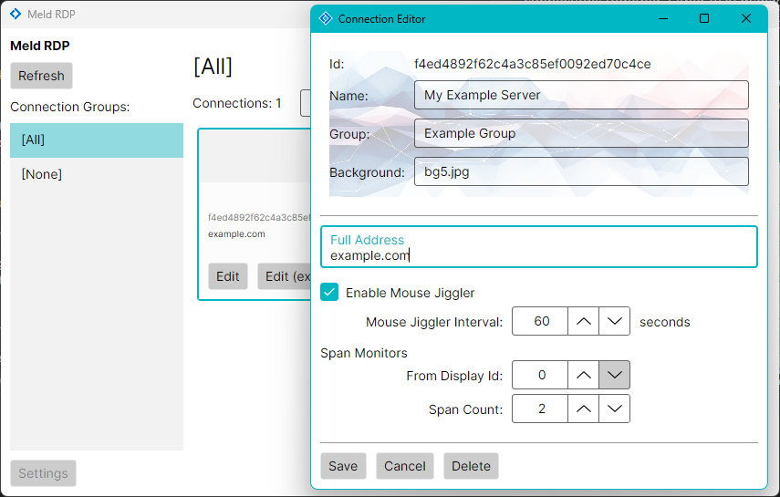
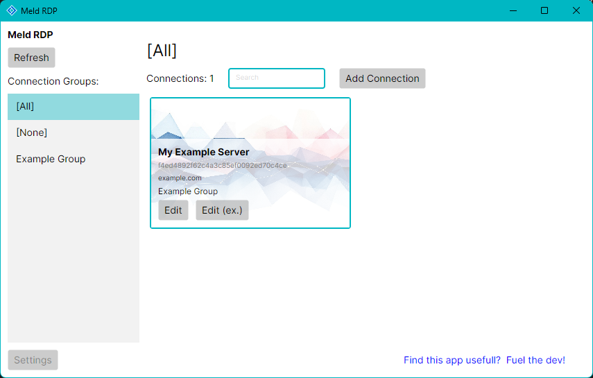

# Meld RDP
**A Fast, Portable Remote Desktop Manager**

**Meld RDP** is a lightweight, portable application designed to simplify the management of
your remote desktop client (`*.rdp`) connections. 

I created this tool because I was frustrated with the current connection managers out there -
they were either too slow, overly complex, or lacked portability.

It's free for personal use. For commercial use, I'm asking people to either contribute
a PR or [donate](https://buymeacoffee.com/cleon) a few dollars to help support development.
More details are in the [license](LICENCE.md).

I'm sharing this because I think it could help others who need a no-fuss remote desktop
manager.

Thanks for checking it out!

## Features
- [x] Portable
- [x] Quick startup
- [x] Simple to use
- [x] Keyboard shortcuts for quick connections
- [x] Connection Groups
- [x] Quick Search
- [x] Multi-monitor span support
- [x] Keep session alive
- [x] Light and Dark theme support (follows OS setting)
- [x] Custom connection backgrounds

## Quick Start
- Download `MeldRDP.zip` from the [Releases](https://github.com/meld-cp/MeldRDP/releases) page.
- Unzip it and run `Meld RDP.exe`.

- Add a new connection by clicking the `Add Connection` button (or press <kbd>Alt + a</kbd>).
- The RDP connection editor window will pop up, fill in the connection details
and click `Save`.

- Once the RDP edit window is closed, a simpler edit window will pop up where you can give
your connection an optional Name, Group and Background image. Click `Save` to close when done.

- Your connection will now appear in the main window. Click it (or press <kbd>Ctrl + 1</kbd>)
to start the connection.

## Notes
- For the 'Keep session alive' feature to work, this application ships with `MsRdpEx.dll`
and `mstscex.exe` which are developed and maintained by Devolutions
(https://github.com/Devolutions/MsRdpEx)

- All RDP files are saved in the `Connections` folder in the same directory as the application.
You can also simply copy your existing `*.rdp` files into this location to 'import' them.

## Keyboard Shortcuts
- <kbd>Alt + a</kbd> - Add a connection
- <kbd>Ctrl + 1</kbd> to <kbd>Ctrl + 0</kbd> - Connect to the item in that list position (note
that <kbd>Ctrl + 0</kbd> will connect to the 10th connection in the visible list)
- <kbd>Ctrl + r</kbd> - Refresh the connection list

